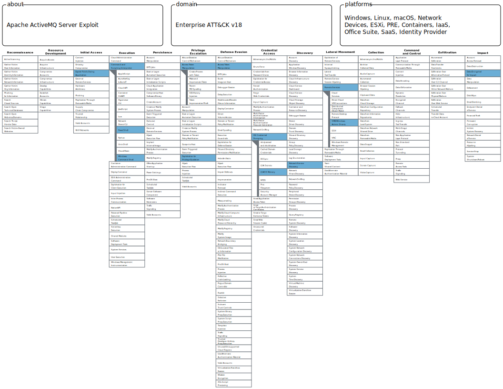

# The 40-Minute Silence
*Catching the Moment Before the Network Falls Apart*

*Based on the DFIR [“Apache ActiveMQ Exploit Leads to LockBit Ransomware”](https://thedfirreport.com/2026/02/23/apache-activemq-exploit-leads-to-lockbit-ransomware/)*

## **Why This Report**

Exploitation of an exposed service followed by credential theft and lateral movement is one of the most common real-world intrusion patterns. It reflects a classic and highly effective attacker chain: initial access → credential access → internal spread.

What makes this pattern particularly important is not just its frequency, but how it exposes a critical gap in many defensive strategies.

In real environments, detection tends to cluster around two extremes. On one side, defenders may catch the initial exploit - but this is often inconsistent, dependent on available visibility, signatures, or specific vulnerabilities. On the other side, detection frequently occurs only at the final high-signal stage, such as ransomware execution - when the impact is already severe and containment is far more difficult.

What is often missed is the post-exploitation phase in between. This is the window where attackers are establishing persistence, harvesting credentials, and moving laterally, but *have not yet reached their end goal*. From a defensive perspective, this is the most valuable moment to detect and respond, because access is still containable and damage can still be prevented.

## **Attack Overview**

### **Scenario**

The attacker exploits a vulnerable Apache ActiveMQ service to gain remote execution.
Their intent is not to immediately disrupt the system, but to:

- gain stable execution
- escalate privileges
- extract credentials
- expand control across the environment

### **Timeline**

1. Initial access
    - Remote code execution via exposed Apache ActiveMQ service
    - Payload retrieval using [certutil](../../tools/certutil.md) utility
2. ~40 minutes later
    - Deployment of [Meterpreter](../../tools/meterpreter.md) for interactive control
    - Privilege escalation to SYSTEM
    - LSASS access (credential dumping)
4. ~20 minutes later
    - SMB scanning across the network
    - Lateral movement begins using harvested credentials
5. Later stages
    - Persistence mechanisms established
    - Ransomware deployment using [LockBit](../../tools/lockbit.md)

**Key insight:** There is a ~40-minute window before credential access and expansion begin. This is the only phase where the attacker is actively generating detectable artifacts, but hasn’t established reusable access yet.

## **Detection opportunity**

**Key moment**: initial foothold → credential access (LSASS) transition

**Before this:**
- attacker access is limited
- detection is largely tool- or exploit-based (and easier to bypass)
  
**After this:**
- attacker gains reusable credentials
- can scale across systems

This is also the last point where access is still localized and containment is realistic.

## **Detection ideation**

#### Detection Logic (Conceptual):

*Detect when execution originating from a service is followed by command execution leading to LSASS access within a constrained time window (~45 minutes)*

#### **Why these conditions:**

Catching attacker at credential access allows us to avoid widespread lateral movement, loss of credential control (potentially domain-wide compromise) and finally attacker establishing persistent durable multi-host access.

Linking it to service-origin execution ties it back to initial compromise and abnormal admin activity, which creates the best combination of high-confidence/low-noise signal.

#### **How it generalizes beyond this case:**

This detection sequence easily adapts for:

- web application exploitation
- exposed enterprise services
- any initial foothold that leads to credential theft

It's so reusable, because *credential access is a necessary step for most large-scale intrusions*.

## **Why common detections fail here**

Usually detection focus is on:

- exploit detection (not always reliable)
- malware signatures (often absent in fileless attacks)

Individual signals like command execution or service activity are too common on their own.

Without chaining these events, the attacker activity blends with normal operations, which is exactly what we try to avoid here.

## **Detection perks and limitations**

#### **False Positives:**

- Use administrative or security tools accessing LSASS *(*reduced by requirement of preceding service-linked execution)*

#### **Bypass Opportunities:**

- Avoid LSASS access via:
    - token theft
    - Kerberos-based techniques
- Spread actions beyond detection time window

#### **What attackers still cannot avoid:**

- They have to obtain usable credentials in some form
- The transition from local foothold to broader access still must happen

## **Detection logic (EQL)**

```eql
sequence by host.id with maxspan=45m

/* 1. Suspicious execution from service-linked context */
[process where event.type == "start" and (
    process.parent.name in ("java.exe","javaw.exe")
    and process.executable : ("C:\\Users\\*","C:\\Windows\\Temp\\*","C:\\ProgramData\\*")
)]

/* 2. Suspicious command execution spawned from that context */
[process where event.type == "start" and
    process.name in ("cmd.exe","powershell.exe","rundll32.exe") and
    not process.command_line in ("*\\Windows\\System32\\*", "*Program Files*")
]

/* 3. LSASS access excluding known benign processes */
[process where event.type == "access" and
    process.target.name == "lsass.exe" and
    not process.name in ("MsMpEng.exe","csrss.exe","wininit.exe")
]
```

## **Detection dependencies**

*This detection can help in many environments, but high-confidence results rely on:*

#### **System setup**

Ideally, EDR with:
- process creation telemetry
- process access visibility (LSASS)

#### **Correlation requirements**

Ability to:

- correlate process chains over time
- associate access events with originating processes

#### **Failure / degradation analysis**

- If LSASS access logs missing → detection loses key signal
- If process lineage missing → detection becomes noisy
- If correlation not implemented → events appear benign
- If EDR visibility limited → attacker activity blends

## **Triage Guidance**

#### **When triggered, investigate:**

- What process originated from the service?
- Was the system externally exposed?
- Is LSASS access expected on this host?

#### **What confirms malicious vs benign:**

*Malicious:*

- unexpected LSASS access
- command execution from service context
- follow-on internal connections

*Benign:*

- known administrative tooling with expected behavior
- documented maintenance activity


## **MITRE ATT&CK Mapping**


