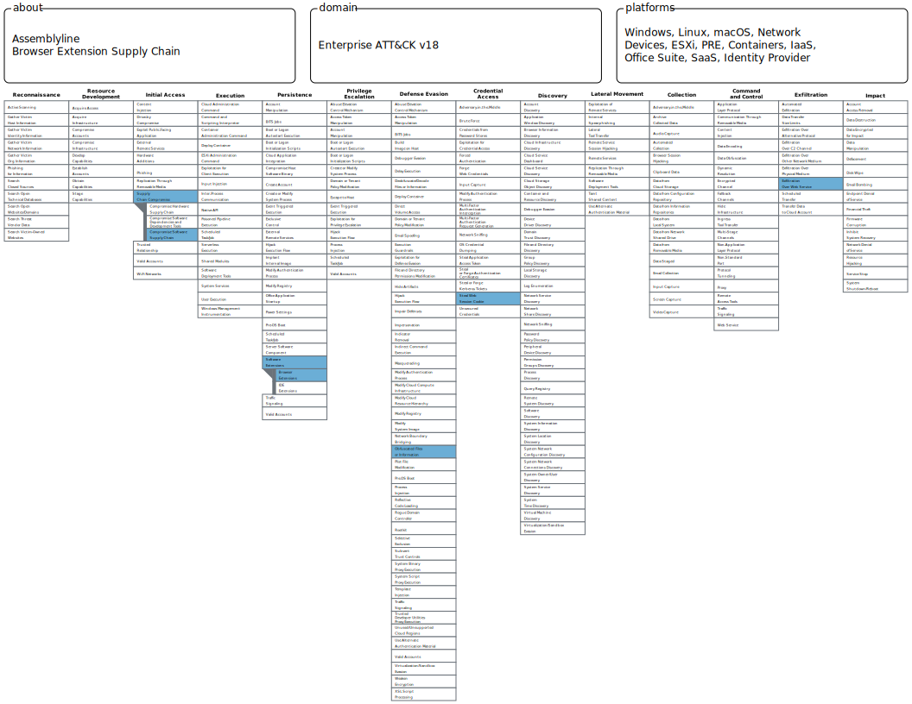

# The Trusted Update

*Catching Malicious Code Before the Extension Fires*

*Based on the Red Canary report ["Moving up the Assemblyline: Exposing malicious code in browser extensions"](https://redcanary.com/blog/threat-detection/assemblyline-browser-extensions/)*

---

## **Why This Report**

Browser extensions update silently, automatically, and with elevated trust, all by design. When a legitimate extension is compromised at the supply chain level, defenders face one of the hardest problems in detection: the malicious code arrives through the official distribution channel, signed by the original publisher, installed by the browser itself.

What makes this pattern particularly dangerous is the complete absence of traditional attack signals. There is no exploit, no dropper, no suspicious process lineage to chase. The malware doesn't arrive - it updates in.

And yet there is a window.

Between the moment an extension silently updates on a user's machine and the moment the new code executes and reaches out to a C2 server, the extension package exists as a static file. It can be analyzed. It can be compared to what was there before. The structural changes that make a malicious update dangerous - a new content script with obfuscated code, a service worker that now contacts a new domain, entropy patterns inconsistent with the original developer's style - are all present and detectable before a single byte of credential data is sent anywhere.

This is what makes this case interesting from a detection standpoint. The attack surface is not process execution or memory. It is the *update event itself*.

Most organizations wait for public reporting before acting on a compromised extension. This investigation explores what it looks like to detect the compromise before anyone publicly knew about it - what signals to look for, how to combine them, and what pipeline architecture makes this work.

---

## **Attack Overview**

### **Scenario:**

A threat actor compromises a legitimate, preferably widely-installed browser extension at the source - by taking over the developer's store account, poisoning the build pipeline, or gaining access to signing credentials. They publish a malicious update that appears functionally identical to the original from the user's perspective, but contains added code designed to harvest cookies, session tokens, or credentials and exfiltrate them to an attacker-controlled domain.

The update propagates automatically to every user with the extension installed. No user action is required.

### **Confirmed Real-World Cases:**

| Extension | Year | Malicious Behavior |
| --- | --- | --- |
| Cyberhaven security extension V3 | 2024 | Cookie harvesting, C2 exfil via `cyberhavenext[.]pro` |
| Trust Wallet | 2025 | Credential theft |
| PaperPanda | 2025 | C2 communication, script injection |
| QuickLens | 2026 | Background script update, new domain |
| Color picker tool - geco | 2025 | New domain, new service worker |

### **Attack Chain:**

1. **Supply chain compromise**
    - Threat actor gains access to extension developer account or build pipeline
    - Malicious code injected into a new version (like Cyberhaven: `24.10.2` → `24.10.4`)
2. **Automatic distribution**
    - Malicious update published to Chrome Web Store or equivalent
    - Browser silently installs the update on all affected endpoints
3. **Code executes**
    - New or modified service worker initializes
    - New content script activates, harvesting cookies or session tokens from browser context
    - Collected data exfiltrated to newly referenced C2 domain
4. **Dwell and persistence**
    - Extension remains installed and trusted
    - Malicious update appears as a routine version bump in store history

### **Detection Opportunity:**

**Key moment**: *when the malicious code is present on disk, and has not yet executed*

This is the only point where a purely static, pre-execution analysis can catch the compromise before any harm occurs.

**Before this:**

- The compromise exists only at the developer/distribution layer - outside defender visibility
- Nothing on the endpoint is yet suspicious

**After this:**

- Malicious code has executed
- Cookies, tokens, or credentials may already be in transit
- Detection relies on network or browser runtime telemetry - reactive by definition

This is also the point where we have the best containment opportunity: the extension can be blocked or removed before any data leaves the environment.

---

## **Detection Ideation**

### Detection Logic (Conceptual):

*When an extension updates, compare the new version's package against the previous version using static analysis. Raise an alert when the delta contains a suspicious combination of: new external domains + modified or added scripts + behavioral signatures consistent with obfuscation or data collection.*

### **Why these conditions:**

Each signal in isolation is too weak to act on:

- New domain: many legitimate updates reference new CDN endpoints
- New script: normal in any feature release
- Base64 in JS: present in enormous amounts of legitimate, minified code

The detection strength comes from **co-occurrence in a version delta**. A legitimate update that simultaneously adds a new domain, a new obfuscated content script, and a CookieHarvesting signature is a statistical outlier — and this holds across all five confirmed real-world compromises backtested in the report.

Entropy anomaly detection adds a second, independent axis: measuring the z-score of a new script’s entropy against the historical entropy of content scripts in the same extension identifies code written by a completely different author. For the Cyberhaven compromise, the new `content.js` produced a z-score of 75.38 - far outside the typical outlier threshold of ~3.5, strongly indicating completely different code authorship.

### **How it generalizes beyond this case:**

This workflow adapts to:

- Any extension distribution platform (Chrome, Firefox, Edge)
- Any supply chain compromise where the attacker controls a code update path
- Package registry attacks (npm, PyPI) - same structural comparison logic applies

The reusability is high, because the code that behaves differently from its usual predecessor leaves structural traces, regardless of what the code actually does.

---

## **Why Common Detections Fail Here**

Standard endpoint detection approaches do not reach this scenario:

- **Process-based detection**: browser extension runtime is sandboxed inside the browser process - there is no separate suspicious binary to catch
- **Network detection**: C2 contact only happens after execution, catching it there means the code already ran
- **Signature-based AV**: the malicious payload is JavaScript inside a zip archive, signed by the original publisher - scanners targeting known-malicious files miss novel compromises entirely
- **Store reputation signals**: the extension retains its install count and legitimate history, the update is published by the original, now-compromised account

Individual telemetry events - service worker registration, network requests from extension context - blend into normal browser noise without version-difference context.

Without comparing what the extension *was* against what it *became*, the attacker’s changes are almost invisible.

---

## **Detection Perks and Limitations**

### **False Positives:**

- Legitimate major refactors with high entropy change and new infrastructure domains
*(Reduced by requiring co-occurrence of multiple signals and by using z-score against the extension's own historical baseline, not global averages)*
- Extensions that use heavily bundled JavaScript by design
*(Mitigated by comparing entropy delta against prior version's distribution, not absolute thresholds)*

### **Bypass Opportunities:**

- Attacker uses a domain already referenced in the previous version, routing exfiltration through existing trusted infrastructure
- Attacker writes low-entropy, readable malicious code to avoid statistical anomaly flags
- Attacker introduces C2 contact on a second or third subsequent update, splitting the signal across versions

### **What attackers still cannot avoid:**

- The malicious update must change *something* in the code - that delta is different
- Cookie harvesting and network exfiltration produce recognizable code structures regardless of obfuscation level
- Any new domain combined with behavioral code changes remains an anomaly in the version diff

### **What this detection does not do:**

- **Monitor runtime behavior** - if malicious code activates only after a delay or under specific conditions, static analysis won't see the trigger
- **Replace endpoint detection** - this is one layer in a defense-in-depth strategy, not a standalone solution
- **Guarantee zero false positives** - legitimate major refactors can trigger multiple signals simultaneously
- **Scale automatically** - the current implementation requires manual submission, but production deployment needs automation

---

## **Detection Plan**

An EQL-only approach was first considered, and of course, it is technically possible to write rules that catch post-execution signals - suspicious network connections from browser extension context, service worker registration events, or cookie access patterns. But catching those means the malicious code has already run. Credentials may already be in transit. At that point the detection is reactive, and the window for clean containment is gone.

This case required a purpose-built multilayered pipeline. Such detection cannot solely live in endpoint telemetry - it relies on the *comparison of two extension package versions*, analyzed by a static analysis tool and fed into Elastic for alerting only.

```
Assemblyline (static analysis)
    ↓  JSON report: old version
    ↓  JSON report: new version
compare_extension.py
    ↓  if alert triggered → writes alert .json to /watched/alerts/
Filebeat (watches /watched/alerts/ through filestream input)
    ↓  new file → ingest into Elasticsearch index: ext-supply-chain-alerts
Elastic alert rule
    ↓  match on matched_rules field → fires when structured alert appears
```

---

## **Prerequisites**

Before the comparison script can run, [Assemblyline](../../tools/assemblyline.md) must already analyze both the old and new extension packages and return structured JSON reports. The script depends on the specific fields being present in those reports.

### **Assemblyline services activated:**

| Service | Purpose |
| --- | --- |
| **Extract** | Unpacks the `.zip`/`.crx` archive so embedded files are individually analyzed |
| **JsJaws** | Behavioral JS analysis — generates signatures like `CookieHarvesting`, `EvalUsage`, `NetworkRequest` |
| **URLCreator** | Extracts domain references from JS code |
| **FrankenStrings** | Detects Base64 and encoded string patterns |
| **Characterize** | Calculates per-file entropy |

### **Fields the script reads from each Assemblyline report:**

Assemblyline's report is nested and keyed by SHA256, so the script traverses several layers to reconstruct detection signals.

- **File structure** - `file_tree` keys each file by hash with a `name` array. Walked to build a filename-to-hash map per version, powering worker-change detection (same filename, different hash) and new-content-script detection (set difference of filenames).
- **Entropy** - pulled from `file_infos[sha].entropy`, cross-referenced with the file tree. Absolute thresholds and per-version deltas are computed in the script, Assemblyline only reports raw values.
- **Domain references** - extracted from result section tags (`domain`, `uri`, `url`), inline section bodies, and raw file ASCII in `file_infos[sha].ascii`. Merged per version, the new-domain signal is the set difference.
- **Behavioral detections** - from the `heuristic` object inside each result's `sections`. Services flag patterns like CookieHarvesting or Base64Decoding with a `heur_id` and `name`, versions compared as `heur_id:name` tuples.

### **Other infrastructure required:**

- Extension inventory tracking which extensions are installed across endpoints and at what version - this is the trigger that initiates the Assemblyline submission
- Both the old and new extension packages (`.zip`/`.crx`) available on disk or retrievable via the Chrome Web Store API
- A local output folder: `/watched/alerts/`
- Filebeat installed with a `filestream` input configured to watch that folder
- An Elasticsearch index `ext-supply-chain-alerts` ready to receive documents

---

## **Detection Logic**

### Comparison Script ([`compare_extension.py`](./compare_extension.py))

Reads two Assemblyline JSON reports, applies five detection rules against the version delta, and writes a structured alert to disk if any rule fires.

### **Conceptual fields used:**

| Signal | Source service | Extraction method |
| --- | --- | --- |
| Domain references | URLCreator, JsJaws, FrankenStrings | Regex over section tags, section bodies, and file ASCII content - aggregated set per version |
| File hashes | Extract | Traverse `file_tree` recursively, key by filename via the `name` array on each SHA256-indexed node |
| New content scripts | Extract | Filename set difference between versions, `manifest.json` excluded from the set |
| Behavioral signatures | JsJaws, FrankenStrings, URLCreator, Characterize | Parse `heuristic` objects nested inside each result's sections, compare by `heur_id:name` tuple |
| Entropy | Characterize | Pull raw entropy from `file_infos[sha]`, compute z-score and delta percentage against the prior version's same file |

### **Detection rules:**

Five rules compare the old and new Assemblyline reports of a single browser extension. Any match writes an alert. Rules are ordered from broadest (highest fire rate, lowest confidence) to most specific (lowest fire rate, highest confidence).
The rules aren’t mutually exclusive - one extension update can trip multiple rules. That’s intentional: the rule combination itself is a confidence signal during triage.

```
Rule 1 (broadest, ~35%):      new domain + updated service worker
Rule 2 (~24%):                new domain + updated worker + new/updated content script
Rule 3 (~40%):                updated worker + new/updated content script
Rule 4 (~11%):                entropy anomaly in new or modified scripts
Rule 5 (tightest, ~9%):       new domain + new signatures + updated worker + new content script
```

*Percentages for Rules 1–5 are fire rates from Red Canary’s 2,850-comparison validation. Rule 1 catches all 5 known compromises. Rule 5 catches 4 of 5 at the lowest noise level.*

### Signals:

Every rule is built from the same five underlying signals, extracted from the Assemblyline report pair:

1. **Added domains** - domains referenced in the new version but absent from the old. Extracted from result sections (tags, URL heuristics), section body text, and raw file ASCII content.
2. **Worker hash change** - the worker.js file (Manifest V3 background script) has a different SHA256 between versions.
3. **New content scripts** - files present in the new version’s file tree that weren’t in the old. The manifest is excluded.
4. **New Assemblyline detections** - heuristics that fired on the new version but not the old (by heuristic ID + name).
5. **Entropy anomaly** - per-file entropy that is either absolute-high (>6.0, suggesting packing or encoding) or changed >50% between versions.

### Filebeat Configuration:

Filebeat watches the alert output folder. Any new `.json` file written there is picked up and ingested into Elasticsearch as a document.

```yaml
# /etc/filebeat/filebeat.yml

filebeat.inputs:
  - type: filestream
    id: ext-supply-chain-alerts
    paths:
      - /watched/alerts/*.json
    parsers:
      - ndjson:
          target: ""
          overwrite_keys: true

output.elasticsearch:
  hosts: ["https://<your-project>.es.<region>.gcp.elastic.cloud:443"]
  api_key: "<api-key-id>:<api-key-value>"
  index: "ext-supply-chain-alerts"

setup.template.enabled: false
setup.ilm.enabled: false

logging.level: info
logging.to_files: true
logging.files:
  path: /var/log/filebeat
  name: filebeat
  keepfiles: 7
  permissions: 0640
```

---

### **Elastic alert rule:**

```
Rule type:    Custom query (Security → Detection Rules)
Index:        ext-supply-chain-alerts
Query:        matched_rules: *
Runs every:   5 minutes
Look-back:    5 minutes
Severity:     High
```

The rule is intentionally simple — the intelligence lives in the comparison script, not the SIEM. The rule's only job is to surface what the script already decided was suspicious.

*Detection implementation, adaptation to real Assemblyline data, and end-to-end validation: [validation.md](./validation.md)*

---

## **Detection Dependencies**

### **Failure / degradation analysis:**

- If extension inventory is missing → pipeline never triggers, detection entirely blind
- If old version package unavailable → no baseline, entropy anomaly and all delta signals fail
- If Assemblyline services are misconfigured → behavioral signatures not generated, Rule 5 degrades silently to Rule 1
- If entropy baseline is too small → z-score unreliable, anomaly rule noisy or silent
- If C2 domain was already in prior version → new-domain signal absent, detection falls back to code-only signals
- If Filebeat loses connectivity → alerts written to disk but not ingested, silent failure unless Filebeat monitoring is separately in place

---

## **Triage Guidance**

### **When triggered, investigate:**

- How many endpoints have this extension installed?
- Is the new version timestamp consistent with the developer's normal release cadence?
- When was the new domain registered? Does it resolve?
- Do the suspicious signatures appear exclusively in the new/changed scripts, or in files already present in the prior version?

### **What confirms malicious vs benign:**

*Malicious:*

- New domain is recently registered and unrelated to the developer's known infrastructure
- CookieHarvesting or credential-related signatures appear only in the new version
- Entropy z-score for a new script is extreme (>10), indicating code authored by a different entity
- Content script added alongside service worker change with no public changelog entry

*Benign:*

- New domain is a known CDN or analytics provider already used across the developer's other extensions
- High entropy is consistent across all prior versions (extension has always used heavily bundled JS)
- Script changes are isolated to localization, CSS, or asset files - not JavaScript execution paths
- Version was accompanied by a public changelog that accounts for all structural changes

---

## **MITRE ATT&CK Mapping**


