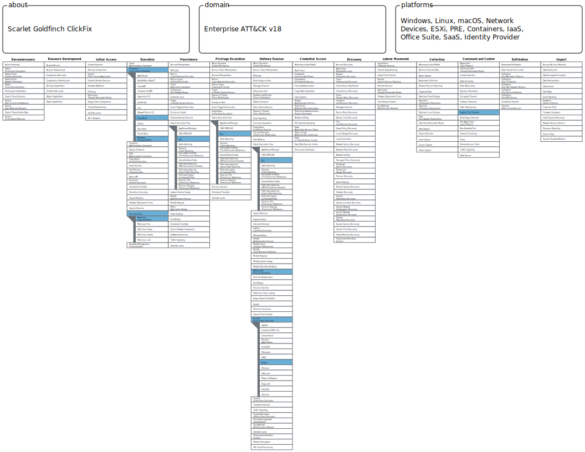

# Seven Epochs of Scarlet Goldfinch

*Catching Paste-and-Run Through Process Lineage, Not Command-Line Strings*

*Based on the Red Canary report [“Scarlet Goldfinch’s year in ClickFix”](https://redcanary.com/blog/threat-intelligence/scarlet-goldfinch-clickfix/) and the [2026 Threat Detection Report entry](https://redcanary.com/threat-detection-report/threats/scarlet-goldfinch/)*

---

## **Why This Report**

Most threat actors change over time. Tooling gets updated, infrastructure rotates, payloads evolve. What makes Scarlet Goldfinch case worth studying carefully is the speed and structure of its adaptation. Across 2025, Red Canary documented seven distinct epochs of initial-access implementation, each one a complete rewrite of the command-line pattern used to deliver the payload. Detection logic that worked for Epoch 1 didn’t fire on Epoch 2. Epoch 2’s didn’t catch Epoch 3. And so on.

This behavior describes an adversary who isn’t just iterating. Someone behind Scarlet Goldfinch is reading what defenders are publishing, identifying what got caught, and moving to ground the defenders probably haven’t yet covered.

One moment in late 2025 makes this unusually clear. In December, Scarlet Goldfinch started using the Windows `finger` command to pull down remote payloads - an old, obscure tool rarely abused in modern attacks. Within the same week, a separate and unrelated paste-and-run group called KongTuke began doing the same thing. Neither had used `finger` before. SANS Internet Storm Center reported the pattern around the same time.

Two disconnected actors adopting the same uncommon technique in the same week isn’t coincidence. It’s the visible side of a dynamic that shapes detection engineering today: adversaries are reading the same threat research that defenders read, and adapting accordingly.

The detection problem this case is built around: write a rule that survives this kind of rapid obfuscation evolution, not one that needs rewriting every time the attacker changes one character.

---

## **Attack Overview**

### **Scenario:**

A user browses a compromised website. The site serves as a lure - a fake CAPTCHA, a fake browser update prompt, a fake “fix this error” dialog. The lure instructs the user to press Win+R (Run dialog) or paste into a terminal, and provides a command pre-copied to their clipboard.

The user, believing they are completing a legitimate verification step or software update, pastes and executes. The pasted command runs under their user context, downloads a payload, and executes it. No exploit is involved. The attack depends entirely on social engineering and user execution.

### **The seven documented epochs:**

| Epoch | Period | Implementation |
| --- | --- | --- |
| 1 | Early 2025 | Direct `curl` download + execute |
| 2 | Mid 2025 | `mshta` with direct URL |
| 3 | Mid 2025 | `forfiles` checking `notepad.exe` existence |
| 4 | Late 2025 | Direct `mshta` (brief reversion) |
| 5 | Late 2025 | Remcos introduced as intermediate payload, `Invoke-CimMethod` for WMI process launch |
| 6 | Dec 2025 to Jan 2026 | `if exist` replacing `forfiles`, `finger` command introduced |
| 7 | Jan 2026 to present | `cmd.exe /v:on` delayed env vars, caret escaping, substring obfuscation |

Each epoch lasted from weeks to a few months. The payload chain (Remcos to NetSupport Manager to optional StealC/ArechClient2) remained broadly consistent from Epoch 5 onward. The command-line delivery is where most of the iteration happened.

### **Attack Chain:**

1. **Initial access**
    - User visits compromised site, encounters ClickFix-style lure
    - User pastes crafted command into Run dialog (creates `explorer.exe → cmd.exe` lineage) or terminal
2. **Stage 1 download**
    - Pasted command uses a living-off-the-land binary (`mshta`, `curl`, `forfiles`, `finger`, or combinations) to download an HTA file from Scarlet Goldfinch infrastructure
3. **Payload retrieval**
    - HTA executes and downloads the next stage: an archive masquerading as a PDF
    - Archive contains a legitimate signed EXE paired with a malicious DLL (DLL sideload pattern)
    - Archive is extracted via `tar -xf` to a staging folder in `AppData\\Local`
4. **Persistence and C2**
    - Legitimate EXE launched, sideloaded DLL runs Remcos in the context of the legitimate EXE
    - Remcos downloads, executes, and persists NetSupport Manager
    - Optional later stages: StealC, ArechClient2

### **Detection Opportunity:**

**Key moment**: *the structural process lineage created by paste-and-run delivery, before payload execution completes*

There are multiple detection windows in this chain. The chosen one is the **command interpreter to LOLBin to network** chain, spawned from an `explorer.exe` ancestor. The reasoning:

- It catches the attack before payload download completes (before Remcos, NetSupport, or credential theft)
- It survives all seven documented epochs because every epoch still ends with a command interpreter spawning a LOLBin that makes a network connection
- The obfuscation changes the command-line *string*, not the *process lineage*
- It’s specific enough to keep false positive rates manageable

The main goal is a detection that works against Epoch 7 today and has a reasonable chance of working against Epoch 8 tomorrow, because it targets behavior the attacker cannot easily change without abandoning the paste-and-run model entirely.

---

## **Detection Ideation**

### Why behavioral chain over command-line strings:

The naive approach to Scarlet Goldfinch detection is string matching - look for `mshta` with a URL, or `cmd /v:on`, or `forfiles /p c:\\windows\\system32`. Red Canary’s published screenshots show that each such string-based detection was obsoleted within weeks by the next epoch. Writing rules that match specific keywords is losing the arms race by design.

The behavioral chain - process A spawns process B which makes a network connection - is structurally harder to change. Scarlet Goldfinch can swap `curl` for `certutil` or rename binaries with `OriginalFileName` tricks, but it cannot remove the chain itself without also removing the paste-and-run delivery mechanism.

### The structural endpoint of the arms race:

Epoch 7 reached a point worth noticing. The variant sets a variable `l=ycyyruyly`, then uses substring indexing to extract characters at positions 1, 5, 4, and 7, spelling out `curl`. The command doesn’t contain the string `curl` anywhere. Caret-escaped variants (`^c^u^r^l^`) achieve the same effect through a different mechanism. Delayed environment variable expansion via `cmd.exe /v:on` lets commands assemble themselves at runtime from pieces that never appear in the static argv.

This is interesting not because it’s clever, though it is, but because of what it implies about where the arms race can potentially end.

However the command is obfuscated, the obfuscated text has to eventually decode into real instructions that the CPU executes. The adversary can obfuscate the *recipe* for reaching an action. They cannot obfuscate the *action itself*. At some point, a command interpreter has to spawn a process with a recognizable name. That process has to make a network connection. The decode step is necessary because the machine, at the bottom of every abstraction, has to be told what to do in terms it understands.

This is the layer where detection wins. Not at the command-line string. Not at the specific LOLBin. At the behavior that survives the decode: the process lineage, the network egress, the structural invariants that the technique itself depends on.

### **Detection Logic (Conceptual):**

*When a user pastes and executes a command, watch for the structural process chain that paste-and-run produces: a command interpreter spawned from `explorer.exe`, which then spawns a download-capable LOLBin, which makes an outbound network connection. The chain happens within seconds and is rare in legitimate user activity. The obfuscation in the pasted command can be anything, but the chain stays the same.*

### **Why these conditions:**

Each signal in isolation is too weak to act on:

- `explorer.exe → cmd.exe` lineage: occurs in legitimate admin work
- LOLBin spawned from cmd: occurs in scheduled tasks and IT scripts
- External egress from a download tool: occurs in software updates and legitimate downloads

The detection strength comes from **co-occurrence in a short time window**. A legitimate event chain that simultaneously involves a Run-dialog-spawned interpreter, that interpreter calling a download LOLBin, and that LOLBin reaching external infrastructure within two minutes is rare outside of paste-and-run delivery.

### **How it generalizes beyond this case:**

The structural insight isn’t specific to Scarlet Goldfinch. Every paste-and-run actor shares the same delivery mechanic. SocGholish’s fake-update descendants, the various ClickFix-as-a-service operators, the affiliates using SmartApeSG or ZPHP infrastructure, all generate a similar `explorer.exe → cmd/powershell → LOLBin → network` chain regardless of the specific commands they use.

A detection anchored in that chain catches the activity cluster as a class, not as a specific implementation. When a new epoch rolls out, the rule doesn’t need modification. When a new paste-and-run actor emerges tomorrow using different tooling, the rule probably catches them too, provided they’re still executing paste-and-run rather than something structurally different.

---

## **Why Common Detections Fail Here**

- **Signature-based EDR on Remcos and NetSupport**: NetSupport Manager is a legitimate, signed remote-access tool used by real IT departments. EDR can’t just block it. Remcos signatures work for known variants but are frequently bypassed by crypter-as-a-service operators who re-pack it daily.
- **String-matching on command lines**: every epoch breaks the prior epoch’s string match. By the time a rule is written, tested, and deployed, Scarlet Goldfinch has likely moved to the next variant.
- **Network IOC blocking**: compromised websites rotate. C2 infrastructure rotates. IOC feeds are always behind the actual infrastructure by hours to days.
- **User awareness training alone**: the lures are convincing, especially the fake-CAPTCHA variants. Training reduces the attack surface but cannot eliminate it.

---

## **Detection Perks and Limitations**

### **False Positives:**

- Administrator paste-and-run workflows for IT troubleshooting and manual remediation
*(Mitigated by scoping to non-admin user contexts in environments where this is common, or pairing with a user-activity signal)*
- Scheduled tasks invoking curl or certutil for legitimate downloads
*(Mitigated for the LOLBin egress rule by excluding `svchost.exe` parent ancestry where this is documented)*
- Legitimate software using `cmd /c` invocations from explorer.exe
*(Rare in modern Windows environments, but exists in some legacy IT tooling)*

### **Bypass Opportunities:**

- Attacker uses `Invoke-CimMethod` to launch processes through WMI, reparenting under `WmiPrvSE.exe` and breaking the explorer.exe lineage match (Scarlet Goldfinch did this in Epoch 5)
- Attacker introduces an intermediate process between explorer.exe and the command interpreter (Scarlet Goldfinch did this in Epoch 3 with `forfiles`)
- Attacker uses FileFix variant - tricking the user into pasting into File Explorer’s address bar instead of Run dialog, producing different process lineage
- Attacker renames LOLBin to bypass `process.name` matching (mitigated by `process.pe.original_file_name` fallback, if captured)

### **What attackers still cannot avoid:**

- The pasted command must eventually invoke *some* process to download payload from external infrastructure
- That process must make an outbound network connection at some point in the chain
- The chain happens in user-process context, originating from the user’s interactive session

### **What this detection does not do:**

- **Catch all variants** - intermediate parents (Epoch 3) and WMI reparenting (Epoch 5) require additional rules
- **Replace runtime detection** - if the malicious payload reaches the endpoint despite this layer firing, EDR signatures and network monitoring still need to catch the next stages
- **Distinguish malicious pastes from legitimate ones** - the rules detect behavior, not intent. Admin troubleshooting will fire the same alerts.
- **Scale to all paste-and-run variants** - FileFix and clipboard-monitoring variants need separate coverage

---

## **Detection Plan**

The detection lives entirely in endpoint telemetry. Two correlated rules in Elastic Security:

```
Rule 1: Process chain (EQL sequence)
    [explorer.exe → cmd/pwsh/wscript] → [cmd → LOLBin] within 2m

Rule 2: LOLBin external egress (KQL query)
    LOLBin process making network connection to non-RFC1918 destination
```

The rules are correlated at triage by host and time. Both firing on the same `host.name` within two minutes is the high-confidence indicator. Either firing alone is medium confidence and warrants investigation.

The split into two rules was forced by lab testing, not by design preference. EQL sequences in this Elastic deployment did not correlate events across the `endpoint.events.process` and `endpoint.events.network` data streams, so the originally drafted three-stage sequence had to be restructured. Documentation in [validation.md](notion://www.notion.so/lemoncello/validation.md).

---

## **Prerequisites**

The detection requires Elastic Defend or equivalent endpoint telemetry providing:

- **Process Create events**: `process.parent.name`, `process.name`, `process.entity_id`, `process.pe.original_file_name`
- **Network Events**: `event.category`, `event.action`, `destination.ip`

In the validation lab, all fields came from Elastic Defend’s `endpoint.events.process` and `endpoint.events.network` data streams. Sysmon was also enabled but the rules do not query it directly. ECS field paths are the same regardless of source.

### **Other infrastructure required:**

- Windows endpoint with Elastic Defend or compatible endpoint sensor enrolled
- Elastic Cloud or self-managed Elasticsearch with Kibana Security
- Detection rule scheduling enabled, every 5 minutes minimum

---

## **Detection Logic**

### Rule 1: Process chain ([`detection.eql`](./detection.eql))

EQL sequence catching the paste-and-run lineage: a command interpreter spawned from `explorer.exe`, which then spawns a download-capable LOLBin.

```
sequence with maxspan=2m
  [process where
      process.parent.name == "explorer.exe"
      and process.name in (
          "cmd.exe", "powershell.exe", "pwsh.exe",
          "wscript.exe", "cscript.exe"
      )] by process.entity_id

  [process where
      process.parent.name in (
          "cmd.exe", "powershell.exe", "pwsh.exe",
          "wscript.exe", "cscript.exe"
      )
      and (
          process.name in (
              "mshta.exe", "curl.exe", "certutil.exe",
              "bitsadmin.exe", "forfiles.exe", "hh.exe",
              "regsvr32.exe", "finger.exe"
          )
          or process.pe.original_file_name in (
              "mshta.exe", "curl.exe", "CertUtil.exe",
              "bitsadmin.exe", "forfiles.exe", "finger.exe"
          )
      )] by process.parent.entity_id
```

### Rule 2: LOLBin external egress ([`detection-lolbin.kql`](./detection-lolbin.kql))

KQL custom query catching LOLBins making external connections.

```
process.name: ("mshta.exe" or "curl.exe" or "certutil.exe" or "bitsadmin.exe" or "finger.exe")
and event.category: "network"
and event.action: "connection_attempted"
and not destination.ip: ("10.0.0.0/8" or "172.16.0.0/12" or "192.168.0.0/16" or "127.0.0.0/8" or "169.254.0.0/16" or "::1/128" or "fe80::/10")
```

### **Signals:**

Both rules are built from the same underlying behavioral signals, observable in endpoint process and network telemetry:

1. **Run-dialog interpreter spawn** - command interpreter (`cmd.exe`, `powershell.exe`, `wscript.exe`) with `explorer.exe` as direct parent. Rare outside of paste-and-run.
2. **Interpreter to LOLBin transition** - command interpreter spawning a download-capable binary (`mshta`, `curl`, `certutil`, `bitsadmin`, `forfiles`, `finger`, `hh`, `regsvr32`).
3. **External egress from LOLBin** - any of the above making outbound connections to non-RFC1918, non-loopback destinations.
4. **Renamed binary fallback** - `process.pe.original_file_name` matching even when `process.name` has been changed.

### **Deployment configuration:**

|  | Rule 1 | Rule 2 |
| --- | --- | --- |
| Type | Event Correlation (EQL) | Custom query (KQL) |
| Index | `logs-*` | `logs-*` |
| Schedule | every 5 min, look back 10 min | every 5 min, look back 10 min |
| Severity | High | Critical |
| Risk score | 73 | 99 |

Rule 2 is set higher because external network egress from a download LOLBin is a stronger standalone signal than process lineage alone. A SOC dashboard or correlation rule should treat co-occurrence of both rules within two minutes on the same host as the highest-priority indicator.

---

## **Detection Dependencies**

### **Failure / degradation analysis:**

- If Elastic Defend is not deployed → no process or network telemetry, both rules go silent
- If `process.entity_id` and `process.parent.entity_id` are not consistently populated → Rule 1 sequence cannot correlate stages
- If `process.pe.original_file_name` is not captured → Rule 1 stage 2 renamed-LOLBin fallback inactive, renamed binaries evade
- If endpoint sensor’s network event linkage to processes is broken → Rule 2 cannot tie connections to LOLBin processes
- If detection rule schedule lags significantly behind real-time → alerts surface after attacker has completed the kill chain

---

## **Triage Guidance**

### **When triggered, investigate:**

- What was in `process.command_line` for the cmd.exe and curl.exe events? Obfuscated commands are themselves a strong indicator.
- What is the destination IP and domain? Recently registered or low-reputation destinations strengthen confidence.
- Is the user account an administrator or a regular user? Admin accounts have higher legitimate paste-and-run rates.
- What ran after the LOLBin connected? Did files get written to `AppData\\Local\\<random-digits>\\`? Did `tar -xf` execute? Did a signed EXE load an unexpected DLL from that path?

### **What confirms malicious vs benign:**

*Malicious:*

- Destination domain is recently registered, low-reputation, or matches Scarlet Goldfinch infrastructure patterns
- Subsequent activity: archive extracted to AppData with random-digit folder name, signed EXE loading sideloaded DLL
- Command line shows obfuscation patterns (substring indexing, caret escaping, delayed expansion)
- User context is non-admin and the user has no plausible reason to paste shell commands

*Benign:*

- Destination is a known software vendor or trusted external service the organization uses
- User is an administrator with documented IT troubleshooting context
- Command line is a recognizable IT operation (running a setup script, fetching a config, manual download for legitimate purpose)
- No subsequent suspicious file or process activity follows the alert

### **Confidence level by alert combination:**

| Alert pattern | Confidence | Action |
| --- | --- | --- |
| Both rules fire on same host within 2 min | High | Investigate immediately, isolate if destination has poor reputation |
| Rule 1 alone | Medium | Investigate, check command line and downstream activity |
| Rule 2 alone | Medium | Check parent process, may be Epoch 3-style intermediate variant or legitimate scheduled task |

*Detection implementation, lab adaptations, and end-to-end validation: [validation.md](./validation.md)*

---

## **MITRE ATT&CK Mapping**


